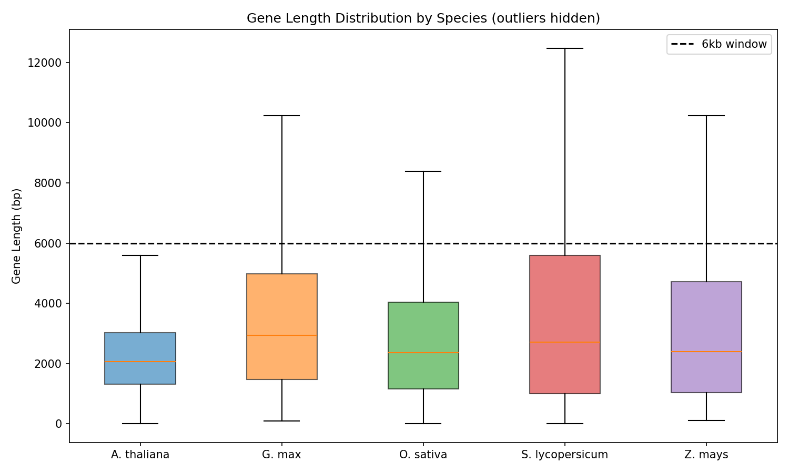
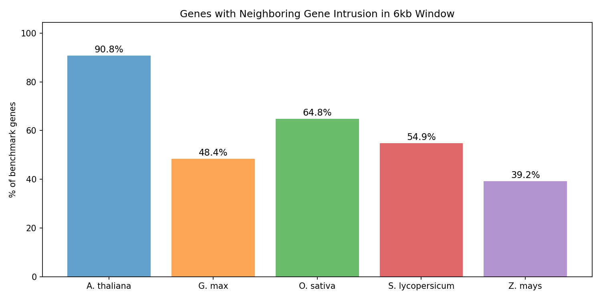

# Predicting Gene Expression Directly from DNA

**EVO2 Genomic AI** is a fine-tuned genomic foundation model that predicts gene expression levels from raw DNA sequences — no intermediate annotations required.

Built by Oregon State University students as part of the CS46X Senior Capstone program, in partnership with the Jaiswal and Megraw labs.

[View on GitHub](https://github.com/maratmuz/CS46X_Project){: .btn} &nbsp; [Open an Issue](https://github.com/maratmuz/CS46X_Project/issues){: .btn}

---

## The Problem

Understanding which genes are expressed — and when, and how much — is one of the central problems in biology. Existing tools either require expensive wet-lab assays or depend on hand-crafted gene annotations that are incomplete for many species.

**We ask: can a large genomic model learn expression directly from the sequence itself?**

The EVO2 model, a 7-billion-parameter DNA foundation model trained on millions of genomes, gives us a new way to answer that question. Our project fine-tunes EVO2 specifically for gene expression prediction and builds the tooling to make that possible on real HPC infrastructure.

---

## What We Built

### 1. Sequence-to-Expression Pipeline

A full pipeline from raw FASTA sequences to expression predictions. We extract gene-flanking windows, mask coding regions to test how much the model relies on regulatory sequence vs. coding sequence, and feed the result into a fine-tuned EVO2 head.

### 2. Masked-Region Dataset Builder

To probe what the model actually learns, we built a dataset variant that masks out the coding sequence, forcing the model to rely on promoters, UTRs, and other regulatory context.

### 3. Dataset Analysis & Quality Checks

Before training, we characterized our dataset thoroughly. The figures below show two key properties our pipeline has to handle correctly.

<div style="display: flex; gap: 1.5rem; flex-wrap: wrap; margin: 1.5rem 0;">
  <figure style="flex: 1; min-width: 280px;">
    
    <figcaption><em>Gene length varies dramatically across species — our pipeline dynamically adjusts context windows rather than truncating.</em></figcaption>
  </figure>
  <figure style="flex: 1; min-width: 280px;">
    
    <figcaption><em>Neighbor-gene intrusion into context windows — a key data-quality issue we detect and handle explicitly.</em></figcaption>
  </figure>
</div>

### 4. Helixer Baseline Integration

We benchmark against [Helixer](https://github.com/weberlab-hhu/Helixer), a state-of-the-art deep learning model for gene structure annotation, to ground our results in a real comparison point.

<figure style="margin: 1.5rem 0;">
  
  <figcaption><em>Helixer architecture — our primary baseline for gene-level evaluation.</em></figcaption>
</figure>

### 5. HPC Training Infrastructure

Training a 7B-parameter model requires serious compute. We built SLURM-based training scripts and conda environment setup tailored to the OSU HPC cluster, with reproducible configs and checkpoint management.

---

## Try It / Access the Code

**Requirements:** Linux, CUDA 12.8, cuDNN 8.9, Conda

```bash
# Load modules (OSU HPC / Lmod clusters)
module load cuda/12.8
module load cudnn/8.9_cuda12

# Clone and set up
git clone https://github.com/maratmuz/CS46X_Project.git
cd CS46X_Project
./scripts/setup/setup_evo2_conda.sh
```

For full setup instructions, see the [Training Guide](training.md). For evaluation details, see the [Evaluation Guide](evaluation.md).

---

## Team

| Name | Role | GitHub |
|------|------|--------|
| Aiden Gabriel | Partner & Mentor Coordination | [gabrieai](https://github.com/gabrieai) |
| Jared Lim | Development | [limjar](https://github.com/limjar) |
| Caleb Lowe | Security & Technical Lead | [lowecal](https://github.com/lowecal) |
| Levi Minch | Project Lead | [leviminch](https://github.com/leviminch) |
| Marat Muzaffarov | Documentation | [muzaffam](https://github.com/muzaffam) |

**Sponsor:** Ken Janik  
**Mentors:** Prof. Pankaj Jaiswal · Prof. Molly Megraw — Oregon State University

**Questions or feedback?** [Open a GitHub Issue](https://github.com/maratmuz/CS46X_Project/issues) or email the project lead at minchle@oregonstate.edu.

---

<small>Oregon State University · CS Senior Capstone · 2025–2026</small>
